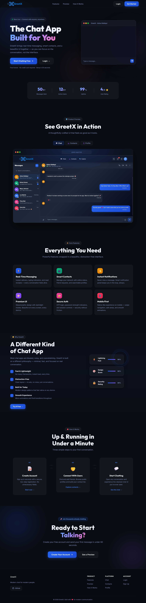
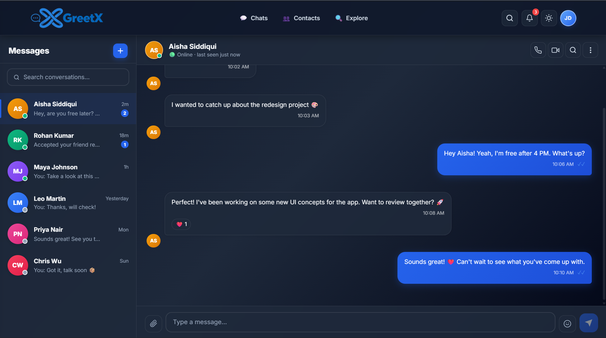
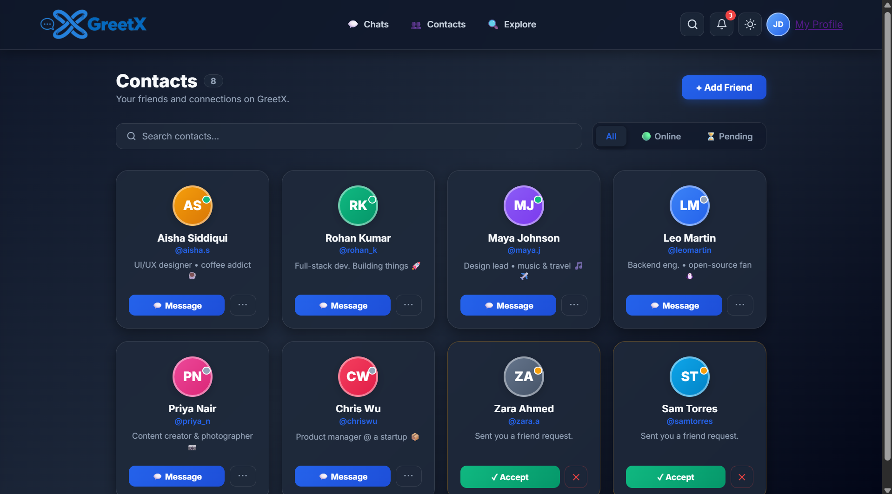
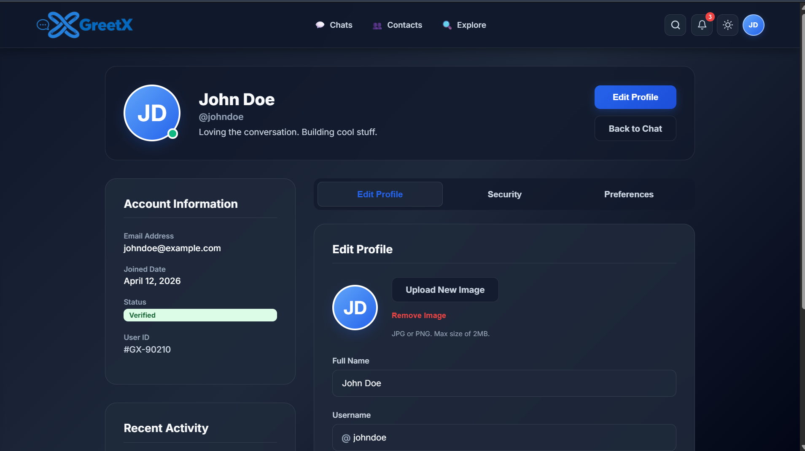
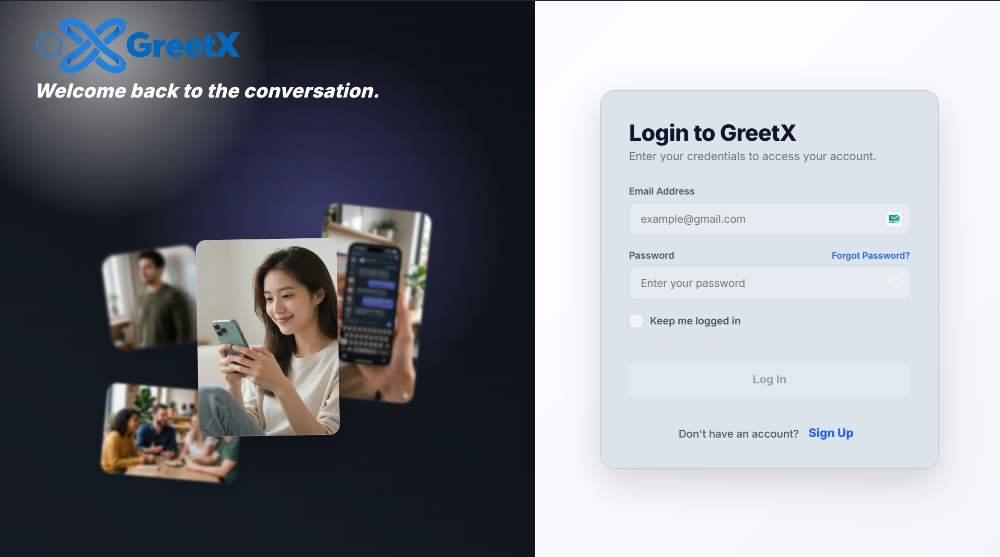

# GreetX — Modern Chat for Modern People

GreetX is a high-performance, premium chat platform designed for real human connection. Built with a sleek **Glassmorphic** aesthetic, it offers a fast, beautiful, and secure environment for real-time communication.

---

## ✨ Core Features

### 🚀 Premium Landing Page
- **Animated Hero Section**: Featuring a live-simulated chat preview and dynamic scroll-reveal animations.
- **Interactive Product Preview**: Seamlessly switch between Chat, Contacts, and Profile views before signing up.
- **Micro-animations**: Stats counters, floating icons, and smooth anchor scrolling for an engaging first impression.

### 🔐 Secure & Modern Authentication
- **Split-Screen Layout**: Immersive visual context during the onboarding process.
- **Two-Step Registration**: A streamlined flow with real-time password strength validation and verification badges.
- **Dual Login Methods**: Support for traditional Password login and secure **OTP (One-Time Password)** authentication.
- **Auto-fill Optimization**: Custom handling for browser autofill to maintain the glassmorphic background integrity.

### 💬 Interactive Chat Experience
- **Fluid Messaging**: Real-time delivery feel with typing indicators and read receipts.
- **Rich Interaction**: Integrated emoji picker and per-message reactions (❤️, 👍, 😂, etc.).
- **Smart Sidebar**: Searchable conversation list with online status indicators and unread badges.
- **Mock Auto-Reply**: Interactive simulation of a responsive chat environment.

### 👤 Profile & Contacts Management
- **Centralized Settings**: Two-column dashboard for editing profile details, security settings, and app preferences.
- **Live Preview**: Mock image-upload with `FileReader` previews and interactive bio character counters.
- **Contact Directory**: Manage your network with searchable public profiles and friendship statuses.

### 📱 Unified Mobile Experience
- **Premium Side-Drawer**: A feature-rich mobile navigation system with integrated search, profile hero card, and theme switching.
- **Responsive Notification Panel**: Centered, glassmorphic panel sitting perfectly beneath the mobile navbar.
- **Optimized UI**: Native-like experience with safe-area support, mobile-first logo scaling, and fluid transitions.

### 🌓 Global Theme Engine
- **Dark/Light Mode**: Instant theme switching powered by real-time CSS variable toggling.
- **State Persistence**: Theme choice is securely preserved via `localStorage` for a consistent experience across sessions.

---

## 📸 UI Gallery

### 🌐 Landing Page


### 💬 Chat Interface


### 👥 Contacts Directory


### 👤 User Profile


### 🔐 Login & OTP


### 📝 Signup Flow
.png)
.png)

---

## 🛠️ Tech Stack

- **Backend**: Python Flask (Jinja2 Templates)
- **Frontend**: Vanilla HTML5, CSS3 (Modern HSL Colors, Glassmorphism, CSS Variables)
- **JavaScript**: Pure Vanilla JS (No heavy frameworks, for maximum performance)
- **Icons & Fonts**: Google Fonts (Inter, Outfit), SVG Path Icons

---

## 🚀 Getting Started

1. **Clone the repository**:
   ```bash
   git clone https://github.com/Ronit552/greetx-chat-platform.git
   cd greetx-chat-platform
   ```

2. **Navigate to the backend**:
   ```bash
   cd backend
   ```

3. **Install dependencies** (optional, uses Flask):
   ```bash
   pip install -r requirements.txt
   ```

4. **Run the server**:
   ```bash
   python app.py
   ```

5. **Access the app**:
   Open `http://127.0.0.1:5000/` in your browser.

---

Built with ❤️ for modern communication.